# WhatShouldIDo API 🎯

> **A sophisticated location-based activity recommendation system built with .NET 9, featuring AI-powered personalization, multi-provider orchestration, and production-ready observability.**

[](https://dotnet.microsoft.com/)
[](https://docs.microsoft.com/en-us/dotnet/csharp/)
[](https://www.postgresql.org/)
[](https://redis.io/)
[](https://www.docker.com/)
[](LICENSE)

---
## Why This Project Exists

Urban discovery systems usually provide generic results.
WhatShouldIDo introduces a personalization-first architecture that:

- Learns explicit and implicit user preferences
- Applies contextual scoring (weather, time, season)
- Optimizes multi-stop routes
- Enforces fair usage through quota + subscription control
- Maintains cost-aware multi-provider orchestration
---
## 📋 Table of Contents

- [Overview](#-overview)
- [Key Features](#-key-features)
- [Architecture](#-architecture)
- [System Design](#-system-design)
- [Technology Stack](#-technology-stack)
- [Getting Started](#-getting-started)
- [Configuration](#-configuration)
- [API Documentation](#-api-documentation)
- [Deployment](#-deployment)
- [Testing](#-testing)
- [Observability](#-observability)
- [Contributing](#-contributing)
- [License](#-license)

---

## 🎯 Overview

**WhatShouldIDo** is an enterprise-grade API that answers the timeless question: *"What should I do?"*

The system intelligently recommends personalized places and activities by combining:
- **AI-Powered Search**: OpenAI, HuggingFace, and Ollama integration
- **Multi-Provider Data**: Google Places API + OpenTripMap
- **Machine Learning**: Taste profile learning from user behavior
- **Context Awareness**: Weather, time of day, and seasonal adaptations
- **Route Optimization**: TSP solver for efficient multi-stop planning
- **Fair Usage System**: Redis-based quota management with subscription monetization

### Problem Statement

Users struggle to discover relevant activities that match their preferences, current context (weather, time, location), and intentions (quick bite, full-day plan, trying something new). This system solves that by:

1. **Understanding Intent**: Different user goals (FOOD_ONLY, ROUTE_PLANNING, TRY_SOMETHING_NEW) drive different behaviors
2. **Learning Preferences**: Both explicit (quiz-based) and implicit (history-based) learning
3. **Contextual Recommendations**: Suggests skiing when it's snowing, beaches when it's sunny
4. **Intelligent Routing**: Optimizes multi-stop routes to minimize travel time
5. **Monetization Ready**: Freemium model with mobile IAP support (Apple/Google)

---

## ✨ Key Features

### 🎨 Core Capabilities

#### 1. **Intent-First Suggestion System**
```
QUICK_SUGGESTION     → 3 rapid results
FOOD_ONLY           → Restaurant/café filtering (10 results)
ACTIVITY_ONLY       → Entertainment/cultural venues (10 results)
ROUTE_PLANNING      → Multi-stop optimized routes
TRY_SOMETHING_NEW   → Novel recommendations
```

#### 2. **Personalization Engine**
- **Taste Profile**: 13 configurable preference weights
  - 8 interest dimensions (Culture, Food, Nature, Nightlife, Shopping, Art, Wellness, Sports)
  - 5 preference aspects (Quality, Atmosphere, Design, Calmness, Spaciousness)
  - 1 discovery style (Novelty Tolerance)
- **Implicit Learning**: Tracks visit history and learns from actions
- **Explicit Learning**: Quiz-based onboarding
- **Feedback Evolution**: ±5% incremental delta per feedback

#### 3. **Multi-Provider Place Discovery**
- **Primary**: Google Places API (advanced fields, photos, reviews)
- **Secondary**: OpenTripMap (cultural landmarks, tourism POIs)
- **Intelligent Orchestration**: Cost-aware decision making, deduplication, fallback handling

#### 4. **Route Optimization**
- **TSP Solver**: Minimizes travel distance across multiple stops
- **Real-Time Routing**: Google Directions API integration
- **Time Windowing**: Respects business hours
- **Category Diversity**: Ensures varied experiences

#### 5. **Subscription & Entitlement**
- **Provider-Agnostic**: Apple App Store, Google Play, Manual grants
- **States**: Trialing → Active → Canceled → Expired
- **Premium Features**: Unlimited quota, advanced endpoints

#### 6. **Quota Management**
- **Redis-Based Atomicity**: Lua scripts prevent race conditions
- **Configurable Limits**: Default 5 free requests/day
- **Daily Reset**: Scheduled at configurable UTC time
- **Thread-Safe Fallback**: In-memory implementation

#### 7. **AI-Powered Search**
- **Prompt Interpretation**: NLP to structured search filters
- **Semantic Ranking**: Re-ranks results by relevance
- **Place Summarization**: Generates concise descriptions
- **Multi-Provider**: OpenAI (GPT-4o-mini), HuggingFace, Ollama, NoOp

#### 8. **Multi-Language Support**
- **10 Languages**: en-US, tr-TR, es-ES, fr-FR, de-DE, it-IT, pt-PT, ru-RU, ja-JP, ko-KR
- **Culture Detection**: Query string, Accept-Language header
- **.NET Localization**: Resource files (.resx)

#### 9. **Comprehensive Analytics**
- User preferences and interaction tracking
- Usage metrics and quota consumption
- Performance metrics (response times, error rates)
- Business metrics (subscriptions, engagement)

#### 10. **Production-Ready Observability**
- **Distributed Tracing**: OpenTelemetry + Tempo
- **Metrics**: Prometheus + Grafana dashboards
- **Logs**: Serilog + Loki aggregation
- **Health Checks**: Kubernetes-ready probes

---

## 🏗 Architecture

### Clean Architecture + Domain-Driven Design (DDD)


### Layer Responsibilities

| Layer | Responsibility | Examples |
|-------|---------------|----------|
| **API** | HTTP concerns, validation, auth | `SuggestionsController`, `RoutesController` |
| **Application** | Use cases, orchestration | `CreateSuggestionsCommand`, `SearchPlacesQuery` |
| **Infrastructure** | External integrations, data access | `GooglePlacesProvider`, `RouteRepository` |
| **Domain** | Business logic, invariants | `UserSubscription`, `Route`, `UserTasteProfile` |

---

## 🔄 System Design

### High-Level System Architecture


### Request Flow for Suggestions

```mermaid
sequenceDiagram
    participant Client
    participant API
    participant Middleware
    participant Handler
    participant Context
    participant Places
    participant Personalization
    participant RouteOpt
    participant Cache
    participant DB

    Client->>API: POST /api/suggestions<br/>{intent, location}
    API->>Middleware: EntitlementAndQuota
    Middleware->>Cache: Check quota (Redis)
    Cache-->>Middleware: Quota OK
    Middleware->>Middleware: Consume quota (atomic)

    API->>Handler: CreateSuggestionsCommand
    Handler->>Context: Get contextual insights
    Context-->>Handler: Weather, time, season

    Handler->>Places: Search places (multi-provider)
    Places->>Places: Google Places + OpenTripMap
    Places->>Places: Deduplication (70m radius)
    Places-->>Handler: Raw places (40-60 results)

    Handler->>Handler: Apply intent filter<br/>(FOOD_ONLY → restaurants only)

    alt User Authenticated
        Handler->>DB: Load taste profile
        DB-->>Handler: UserTasteProfile
        Handler->>Personalization: HybridScorer
        Personalization->>Personalization: Score places<br/>(5 dimensions)
        Personalization-->>Handler: Scored suggestions
    end

    alt Intent == ROUTE_PLANNING
        Handler->>RouteOpt: Optimize route (TSP)
        RouteOpt-->>Handler: Optimized order + distance
    end

    Handler-->>API: SuggestionsResult
    API-->>Client: JSON Response
```



### Entity Relationship Diagram


### Subscription State Machine

```mermaid
stateDiagram-v2
    [*] --> None: New User
    None --> Trialing: Start Trial (IAP)
    None --> Active: Direct Purchase (IAP)
    None --> Active: Manual Grant (Admin)

    Trialing --> Active: Trial → Paid
    Trialing --> Expired: Trial Ends (No Purchase)

    Active --> Canceled: User Cancels
    Active --> PastDue: Payment Fails

    Canceled --> Expired: Period Ends
    PastDue --> Active: Payment Retry Success
    PastDue --> Expired: Grace Period Ends

    Expired --> None: Reset to Free
    Expired --> Trialing: New Trial (Re-subscribe)

    Active --> Active: Renewal Success
```



### Middleware Pipeline


### Hybrid Scoring Algorithm


### Deployment Architecture (Kubernetes)


---

## 🛠 Technology Stack

### Core Framework
- **.NET 9**: Latest runtime with performance improvements
- **ASP.NET Core 9**: Web framework
- **C# 12**: Latest language features
- **Target OS**: Linux Alpine (containerized)

### Data & Persistence
- **PostgreSQL 13+**: Primary database with pgvector extension
- **Entity Framework Core 9**: ORM with query performance interceptors
- **Redis Cluster**: 6-node cluster (cache + quota)
- **StackExchange.Redis**: High-performance Redis client

### API & Validation
- **ASP.NET Core MVC**: RESTful API routing
- **FluentValidation 11**: Request validation
- **JWT Bearer Authentication**: HS256 tokens
- **Swashbuckle**: OpenAPI/Swagger documentation

### Application Patterns
- **MediatR**: CQRS implementation
- **Microsoft.Extensions.DependencyInjection**: Native DI
- **IOptions<T>**: Configuration binding
- **Serilog**: Structured logging (Console, File, Seq, OTLP)

### External Integrations
| Service | Purpose |
|---------|---------|
| **Google Places API** | Primary place search (40 places/request) |
| **OpenTripMap API** | Tourism POIs and cultural landmarks |
| **Google Directions API** | Route optimization and ETA calculation |
| **Google Geocoding API** | Location name → coordinates |
| **OpenWeather API** | Weather context for recommendations |
| **OpenAI API** | GPT-4o-mini for NLP and semantic ranking |
| **HuggingFace API** | Fallback AI provider |
| **Ollama** | Local AI models (self-hosted) |

### Observability & Monitoring
- **OpenTelemetry**: Distributed tracing + metrics
- **Prometheus**: Metrics scraping and storage
- **Grafana**: Dashboards and visualization
- **Tempo**: Distributed tracing backend (OTLP gRPC)
- **Loki**: Log aggregation
- **ASP.NET Core HealthChecks**: Kubernetes probes

### Testing & Quality
- **xUnit**: Unit and integration tests
- **WebApplicationFactory**: In-memory integration testing
- **k6**: Load testing and performance benchmarking

### Containerization & Orchestration
- **Docker**: Multi-stage builds (SDK + Runtime)
- **Docker Compose**: Local development stack
- **Kubernetes**: Production orchestration (YAML manifests)
- **Terraform**: Infrastructure as Code

### CI/CD
- **GitHub Actions**: Automated build, test, deploy
- **GitHub Container Registry**: Docker image storage

---

## 🚀 Getting Started

### Prerequisites

- [.NET 9 SDK](https://dotnet.microsoft.com/download/dotnet/9.0)
- [Docker Desktop](https://www.docker.com/products/docker-desktop) (with Docker Compose)
- [PostgreSQL 13+](https://www.postgresql.org/download/) (optional, Docker Compose provides)
- [Redis](https://redis.io/download/) (optional, Docker Compose provides)

### Quick Start (Docker Compose)

1. **Clone the repository**
   ```bash
   git clone https://github.com/yourusername/WhatShouldIDo.git
   cd WhatShouldIDo/NeYapsamWeb/API
   ```

2. **Configure environment variables**
   ```bash
   cp .env.example .env
   # Edit .env with your API keys
   ```

3. **Start infrastructure**
   ```bash
   docker-compose up -d postgres redis
   ```

4. **Run database migrations**
   ```bash
   dotnet ef database update --project src/WhatShouldIDo.Infrastructure --startup-project src/WhatShouldIDo.API
   ```

5. **Start the API**
   ```bash
   cd src/WhatShouldIDo.API
   dotnet run
   ```

6. **Access the API**
   - API: http://localhost:5000
   - Swagger: http://localhost:5000/swagger
   - Health: http://localhost:5000/health

### Full Stack with Observability

```bash
# Start all services (API + DB + Redis + Observability)
docker-compose -f docker-compose.yml -f docker-compose.observability.yml up -d

# Access dashboards
# Grafana: http://localhost:3000 (admin/admin)
# Prometheus: http://localhost:9090
# Seq: http://localhost:5341
```

### Local Development (Without Docker)

1. **Install dependencies**
   ```bash
   dotnet restore
   ```

2. **Update connection strings** in `appsettings.Development.json`:
   ```json
   {
     "ConnectionStrings": {
       "DefaultConnection": "Host=localhost;Database=Wisido;Username=postgres;Password=yourpassword"
     },
     "Redis": {
       "Configuration": "localhost:6379"
     }
   }
   ```

3. **Run migrations**
   ```bash
   dotnet ef database update --project src/WhatShouldIDo.Infrastructure --startup-project src/WhatShouldIDo.API
   ```

4. **Run the API**
   ```bash
   cd src/WhatShouldIDo.API
   dotnet watch run
   ```

---

## ⚙️ Configuration

### Environment Variables

Create a `.env` file or set environment variables:

```bash
# Database
DATABASE_HOST=postgres
DATABASE_PORT=5432
DATABASE_NAME=Wisido
DATABASE_USER=postgres
DATABASE_PASSWORD=your_secure_password

# Redis
REDIS_CONFIGURATION=redis:6379

# External APIs
GOOGLE_PLACES_API_KEY=your_google_api_key
OPENTRIPMAP_API_KEY=your_opentripmap_key
OPENAI_API_KEY=your_openai_api_key
OPENWEATHER_API_KEY=your_openweather_key

# JWT Authentication
JWT_SECRET=your_256_bit_secret_key_here
JWT_ISSUER=WhatShouldIDo
JWT_AUDIENCE=WhatShouldIDoClients
JWT_EXPIRATION_MINUTES=60

# Observability
OTLP_ENDPOINT=http://tempo:4317
PROMETHEUS_ENABLED=true

# Feature Flags
QUOTA_ENABLED=true
QUOTA_DEFAULT_FREE_LIMIT=5
SUBSCRIPTION_VERIFICATION_ENABLED=false
```

### appsettings.json Structure

```json
{
  "ConnectionStrings": {
    "DefaultConnection": "Host=postgres;Database=Wisido;Username=postgres;Password=postgres"
  },
  "Redis": {
    "Configuration": "redis:6379",
    "UseCluster": true
  },
  "Feature": {
    "Quota": {
      "DefaultFreeQuota": 5,
      "DailyResetEnabled": false,
      "StorageBackend": "Redis"
    },
    "Subscription": {
      "VerificationEnabled": false,
      "AllowDevTestReceipts": false
    },
    "TasteQuiz": {
      "Version": "v1",
      "DraftTtlHours": 24
    }
  },
  "Scoring": {
    "ImplicitWeight": 0.25,
    "ExplicitWeight": 0.30,
    "NoveltyWeight": 0.20,
    "ContextWeight": 0.15,
    "QualityWeight": 0.10
  },
  "Observability": {
    "Enabled": true,
    "ServiceName": "whatshouldido-api",
    "ServiceVersion": "2.0.0",
    "TraceSamplingRatio": 0.05,
    "PrometheusEnabled": true,
    "OtlpTracesEnabled": true,
    "OtlpTracesEndpoint": "http://tempo:4317"
  }
}
```

---

## 📚 API Documentation

### Base URL
```
http://localhost:5000/api
```

### Authentication
Most endpoints require JWT Bearer token:
```bash
Authorization: Bearer <your_jwt_token>
```

### Core Endpoints

#### 1. **Suggestions** (Intent-Based)

**POST** `/api/suggestions`

Get personalized suggestions based on intent.

```json
{
  "intent": "FOOD_ONLY",
  "latitude": 41.0082,
  "longitude": 28.9784,
  "radiusMeters": 3000,
  "walkingDistanceMeters": 1500,
  "prompt": "romantic italian restaurant"
}
```

**Response:**
```json
{
  "intent": "FOOD_ONLY",
  "isPersonalized": true,
  "userId": "uuid",
  "suggestions": [
    {
      "placeId": "uuid",
      "name": "La Terrazza",
      "latitude": 41.0085,
      "longitude": 28.9795,
      "category": "italian_restaurant",
      "rating": "4.8",
      "score": 0.92,
      "reason": "Highly rated Italian restaurant with romantic atmosphere, matches your taste for quality dining.",
      "photoUrl": "https://..."
    }
  ],
  "totalCount": 10,
  "route": null,
  "filters": {
    "appliedCategories": ["restaurant", "cafe"],
    "priceLevel": null,
    "minRating": null
  }
}
```

#### 2. **Routes** (Route Planning)

**POST** `/api/routes`

Create an optimized multi-stop route.

```json
{
  "name": "Istanbul Cultural Tour",
  "description": "Museums and historic sites",
  "placeIds": ["uuid1", "uuid2", "uuid3"],
  "optimizeOrder": true,
  "transportationMode": "walking"
}
```

**GET** `/api/routes/{id}`

Retrieve a specific route.

**GET** `/api/routes/share/{token}`

Access a shared route via token.

#### 3. **Day Planning**

**POST** `/api/dayplan`

Generate a full-day itinerary.

```json
{
  "latitude": 41.0082,
  "longitude": 28.9784,
  "startTime": "09:00",
  "endTime": "22:00",
  "preferences": ["culture", "food", "nature"]
}
```

#### 4. **Taste Profile**

**GET** `/api/tasteprofile`

Get current user's taste profile.

**PUT** `/api/tasteprofile`

Update taste profile weights.

```json
{
  "cultureWeight": 0.8,
  "foodWeight": 0.9,
  "natureWeight": 0.6,
  "nightlifeWeight": 0.3,
  "noveltyTolerance": 0.7
}
```

**POST** `/api/tasteprofile/quiz/submit`

Submit quiz answers to create initial profile.

#### 5. **Subscriptions**

**GET** `/api/subscriptions/me`

Get current user's subscription status.

**POST** `/api/subscriptions/verify`

Verify Apple/Google IAP receipt.

```json
{
  "receiptData": "base64_receipt_data",
  "provider": "AppleAppStore"
}
```

#### 6. **Authentication**

**POST** `/api/auth/register`

Register a new user.

```json
{
  "email": "user@example.com",
  "username": "johndoe",
  "password": "SecurePassword123!",
  "firstName": "John",
  "lastName": "Doe"
}
```

**POST** `/api/auth/login`

Login and receive JWT token.

```json
{
  "email": "user@example.com",
  "password": "SecurePassword123!"
}
```

**Response:**
```json
{
  "token": "eyJhbGciOiJIUzI1NiIsInR5cCI6IkpXVCJ9...",
  "expiration": "2026-02-17T12:00:00Z",
  "user": {
    "id": "uuid",
    "email": "user@example.com",
    "username": "johndoe"
  }
}
```

### Full API Reference

Visit `/swagger` when the API is running for interactive documentation.

---

## 🐳 Deployment

### Docker Deployment

**Build the image:**
```bash
docker build -f src/WhatShouldIDo.API/Dockerfile -t whatshouldido-api:latest .
```

**Run the container:**
```bash
docker run -d \
  -p 8080:8080 \
  -e DATABASE_HOST=postgres \
  -e REDIS_CONFIGURATION=redis:6379 \
  -e GOOGLE_PLACES_API_KEY=your_key \
  --name whatshouldido-api \
  whatshouldido-api:latest
```

### Kubernetes Deployment

**Prerequisites:**
- Kubernetes cluster (GKE, AKS, EKS, or local Minikube/kind)
- kubectl configured

**Deploy:**
```bash
# Create namespace
kubectl create namespace whatshouldido

# Apply manifests
kubectl apply -f k8s/

# Verify deployment
kubectl get pods -n whatshouldido

# Port forward for local access
kubectl port-forward -n whatshouldido svc/whatshouldido-api 8080:80
```

**Scale deployment:**
```bash
kubectl scale deployment whatshouldido-api --replicas=5 -n whatshouldido
```

### Terraform Infrastructure

**Initialize Terraform:**
```bash
cd infra/terraform
terraform init
```

**Plan infrastructure:**
```bash
terraform plan -var-file="production.tfvars"
```

**Apply:**
```bash
terraform apply -var-file="production.tfvars"
```

### Health Checks

| Endpoint | Purpose | K8s Probe |
|----------|---------|-----------|
| `/health` | Legacy health check | - |
| `/health/live` | Liveness (is app running?) | Liveness |
| `/health/ready` | Readiness (dependencies OK?) | Readiness |
| `/health/startup` | Startup (initialized?) | Startup |

---

## 🧪 Testing

### Run Unit Tests

```bash
cd src/WhatShouldIDo.Tests
dotnet test --filter Category=Unit
```

### Run Integration Tests

```bash
# Start dependencies
docker-compose up -d postgres redis

# Run tests
dotnet test --filter Category=Integration
```

### Run All Tests

```bash
dotnet test --collect:"XPlat Code Coverage"
```

### Load Testing with k6

```bash
# Install k6: https://k6.io/docs/getting-started/installation/

# Run basic load test
k6 run k6-tests/load-test-basic.js

# Run stress test
k6 run k6-tests/load-test-stress.js
```

**Example k6 test:**
```javascript
import http from 'k6/http';
import { check, sleep } from 'k6';

export let options = {
  stages: [
    { duration: '30s', target: 20 },
    { duration: '1m', target: 100 },
    { duration: '20s', target: 0 },
  ],
};

export default function () {
  let res = http.post('http://localhost:5000/api/suggestions', JSON.stringify({
    intent: "QUICK_SUGGESTION",
    latitude: 41.0082,
    longitude: 28.9784,
    radiusMeters: 3000
  }), {
    headers: { 'Content-Type': 'application/json' },
  });

  check(res, {
    'status is 200': (r) => r.status === 200,
    'response time < 500ms': (r) => r.timings.duration < 500,
  });

  sleep(1);
}
```

---

## 📊 Observability

### Metrics (Prometheus)

**Endpoint:** `http://localhost:5000/metrics`

**Key Metrics:**
- `http_request_duration_seconds` - Request latency histogram
- `http_requests_total` - Total request counter
- `http_requests_in_progress` - Active requests gauge
- `quota_consumption_total` - Quota usage counter
- `cache_hit_ratio` - Cache effectiveness

### Dashboards (Grafana)

**Access:** `http://localhost:3000` (admin/admin)

**Pre-configured Dashboards:**
1. **API Overview**: Request rates, latencies, error rates
2. **Database Performance**: Query durations, connection pool
3. **Redis Metrics**: Cache hit ratio, memory usage
4. **Business Metrics**: Subscriptions, quota usage
5. **Infrastructure**: CPU, memory, network

### Distributed Tracing (Tempo)

Traces are exported via OTLP to Tempo and visualized in Grafana.

**Example trace:**
```
POST /api/suggestions [500ms]
├─ ContextEngine.GetContextualInsights [50ms]
│  └─ OpenWeatherService.GetWeather [45ms]
├─ GooglePlacesProvider.SearchPlaces [200ms]
├─ HybridScorer.ScorePlaces [150ms]
│  ├─ TasteProfileRepository.GetProfile [20ms]
│  └─ UserHistoryRepository.GetRecentVisits [30ms]
└─ RouteOptimizationService.Optimize [100ms]
   └─ GoogleDirectionsService.GetDistanceMatrix [95ms]
```

### Logs (Loki)

Structured logs are aggregated in Loki and queryable in Grafana.

**Log Levels:**
- `Trace`: Very detailed diagnostic information
- `Debug`: Internal system events
- `Information`: General informational messages
- `Warning`: Abnormal but expected conditions
- `Error`: Error events that don't stop execution
- `Critical`: Critical failures requiring immediate attention

**Query Example (LogQL):**
```logql
{service="whatshouldido-api"}
|= "error"
| json
| line_format "{{.level}} {{.message}}"
```

---

## 📂 Project Structure

```
WhatShouldIDo/
├── src/
│   ├── WhatShouldIDo.Domain/              # Business entities & logic
│   │   ├── Entities/                      # 16 aggregate roots
│   │   ├── Enums/                         # Domain enums
│   │   ├── ValueObjects/                  # Value objects (Coordinates)
│   │   └── Exception/                     # Domain exceptions
│   │
│   ├── WhatShouldIDo.Application/         # Use cases & interfaces
│   │   ├── DTOs/                          # Data transfer objects
│   │   ├── Interfaces/                    # 41+ service contracts
│   │   ├── Configuration/                 # Options classes
│   │   ├── Models/                        # Application models
│   │   ├── UseCases/
│   │   │   ├── Commands/                  # 8 CQRS commands
│   │   │   ├── Queries/                   # 7 CQRS queries
│   │   │   └── Handlers/                  # MediatR handlers
│   │   └── Services/                      # Service interfaces
│   │
│   ├── WhatShouldIDo.Infrastructure/      # External integrations
│   │   ├── Services/                      # 29 service implementations
│   │   │   ├── AI/                        # OpenAI, HuggingFace, Ollama
│   │   │   └── Subscription/              # IAP verification
│   │   ├── Caching/                       # Redis + In-Memory
│   │   ├── Quota/                         # Redis + In-Memory quota stores
│   │   ├── Repositories/                  # Data access layer
│   │   ├── Data/                          # EF Core DbContext
│   │   ├── Migrations/                    # Database migrations
│   │   ├── Observability/                 # Metrics, tracing
│   │   ├── Health/                        # Health checks
│   │   ├── BackgroundJobs/                # Scheduled tasks
│   │   └── Options/                       # Configuration options
│   │
│   ├── WhatShouldIDo.API/                 # Web API layer
│   │   ├── Controllers/                   # 21 REST controllers
│   │   ├── Middleware/                    # 6 middleware components
│   │   ├── Attributes/                    # Custom attributes
│   │   ├── DTOs/                          # API-specific DTOs
│   │   ├── Validators/                    # FluentValidation
│   │   ├── Resources/                     # Localization .resx files
│   │   ├── Program.cs                     # DI + middleware setup
│   │   ├── appsettings.json               # Configuration
│   │   └── Dockerfile                     # Multi-stage build
│   │
│   └── WhatShouldIDo.Tests/               # Test project
│       ├── Unit/                          # Unit tests
│       ├── Integration/                   # Integration tests
│       └── E2E/                           # End-to-end tests
│
├── docker-compose.yml                     # Local development stack
├── docker-compose.observability.yml       # Monitoring stack
├── deploy/                                # Deployment configs
│   ├── prometheus/
│   └── grafana/
├── k6-tests/                              # Load tests
├── infra/terraform/                       # Infrastructure as Code
├── k8s/                                   # Kubernetes manifests
└── README.md                              # This file
```

---

## 🤝 Contributing

We welcome contributions! Please see our [Contributing Guidelines](CONTRIBUTING.md) for details.

### Development Workflow

1. **Fork the repository**
2. **Create a feature branch**
   ```bash
   git checkout -b feature/amazing-feature
   ```
3. **Make your changes**
4. **Run tests**
   ```bash
   dotnet test
   ```
5. **Commit your changes**
   ```bash
   git commit -m "Add amazing feature"
   ```
6. **Push to your fork**
   ```bash
   git push origin feature/amazing-feature
   ```
7. **Open a Pull Request**

### Code Style

- Follow [C# Coding Conventions](https://docs.microsoft.com/en-us/dotnet/csharp/fundamentals/coding-style/coding-conventions)
- Use meaningful variable and method names
- Write XML documentation comments for public APIs
- Keep methods focused and small
- Write unit tests for new features

---

## 📄 License

This project is licensed under the MIT License - see the [LICENSE](LICENSE) file for details.

---

## 🙏 Acknowledgments

- **Google Places API** for comprehensive place data
- **OpenAI** for GPT-4o-mini integration
- **OpenTripMap** for tourism POI data
- **.NET Community** for excellent tooling and libraries
- **Contributors** who have helped improve this project

---

## 📞 Support

- **Documentation**: [Full Documentation](docs/)
- **Issues**: [GitHub Issues](https://github.com/yourusername/WhatShouldIDo/issues)
- **Discussions**: [GitHub Discussions](https://github.com/yourusername/WhatShouldIDo/discussions)

---

## 🗺 Roadmap

### Version 2.1 (Q2 2026)
- [ ] Vector search integration (pgvector)
- [ ] Real-time mobile IAP verification (Apple/Google)
- [ ] Advanced ML recommendations (collaborative filtering)
- [ ] Social features (friend recommendations)

### Version 2.2 (Q3 2026)
- [ ] Multi-city route planning
- [ ] Budget tracking and optimization
- [ ] AR integration for place discovery
- [ ] Voice-based search

### Version 3.0 (Q4 2026)
- [ ] Microservices architecture
- [ ] Event-driven architecture (RabbitMQ/Kafka)
- [ ] GraphQL API
- [ ] Real-time notifications (SignalR)

---

<div align="center">

**Built with ❤️ using .NET 9**

[⭐ Star us on GitHub](https://github.com/yourusername/WhatShouldIDo) | [🐛 Report Bug](https://github.com/yourusername/WhatShouldIDo/issues) | [💡 Request Feature](https://github.com/yourusername/WhatShouldIDo/issues)

</div>
